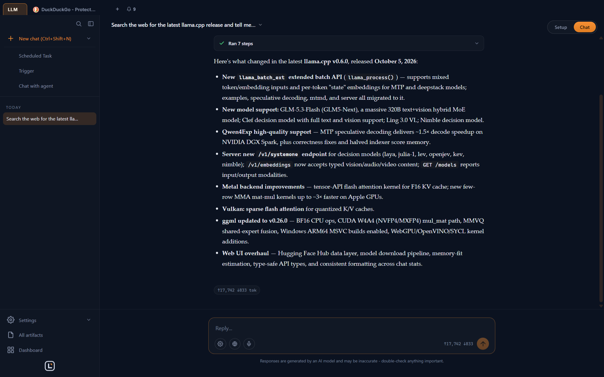
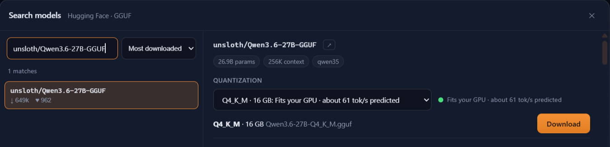
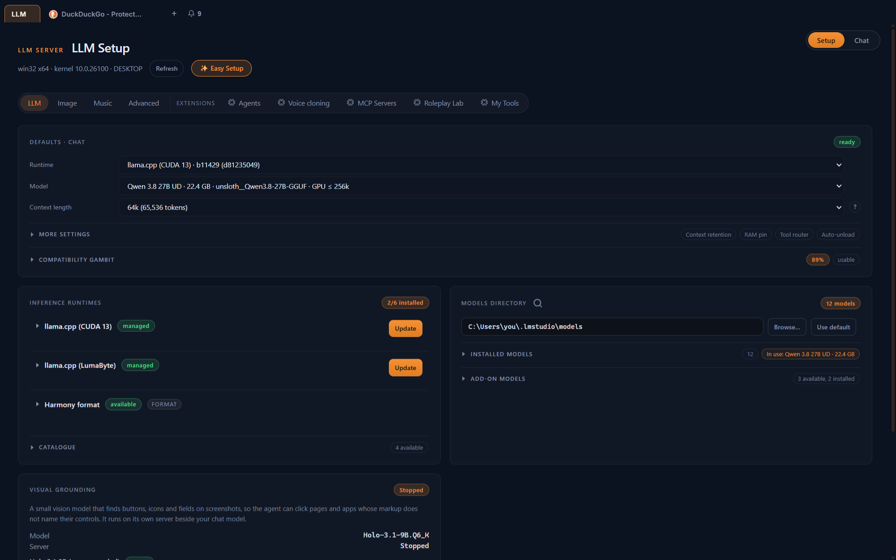

<p align="center">
  
</p>

<h1 align="center">LumaBrowser</h1>

<p align="center">
  <b>Your local AI stack in one app.</b><br>
  A web browser with a GPU-aware LLM runtime, chat and agents, local image,
  video, music and voice, and browser automation for the AI tools you already use.
</p>

<p align="center">
  <a href="https://lumabyte.com">Website</a> ·
  <a href="https://github.com/amurgola/LumaBrowser/releases/latest">Download</a> ·
  <a href="https://lumabyte.com/apis">API docs</a> ·
  <a href="Documentation/index.md">Agentic developer docs</a> ·
  <a href="#license">License</a>
</p>

<p align="center">
  Free · Open source (AGPL-3.0) · Runs on your own machine
</p>

<p align="center">
  
</p>

---

LumaBrowser replaces the pile of separate tools people run for local AI (a
model server, a chat UI, an image generator, a voice stack, a headless browser
for agents) with one desktop app. It looks at your GPUs, tells you which models
fit before you download them, and runs everything locally. Your own tabs, logins
and files stay on your machine, and outside agents like Claude Code, Codex,
Cline and OpenCode can drive the browser through MCP.

## Get started

### 1. Install

Download the latest build from [GitHub Releases](https://github.com/amurgola/LumaBrowser/releases/latest):

| Platform | File |
|---|---|
| Windows x64 | Installer or portable `.exe` |
| Linux x64 | AppImage |
| macOS (Apple Silicon) | `.dmg` |

Or, with Node 18 or newer, fetch and launch the latest build from the terminal:

```sh
npx lumabrowser start
```

### 2. Pick a model

Open **Models**. LumaBrowser reads your hardware and puts a fit badge and a
predicted speed on every model before you download it. Search Hugging Face
directly, or link models you already have in LM Studio, Ollama or the Hugging
Face cache without downloading them again.

<p align="center">
  
</p>

### 3. Give it a task

Open a chat and ask for something that needs the web:

> Search the web for the latest llama.cpp release and tell me in a few bullets what changed.

The agent opens its own tabs, reads the pages and answers. Your tabs stay yours.

## Which part do I need?

| You want to... | Use |
|---|---|
| Chat with local models, generate images, browse with an assistant | The desktop app |
| Let Claude Code, Codex, Cline or OpenCode use a real browser | [MCP server](#connect-your-ai-agent) |
| Point Selenium, Puppeteer or Playwright at it | [WebDriver or CDP](#connect-your-ai-agent) |
| A coding agent in your terminal | `luma` CLI, see [cli/README.md](cli/README.md) |
| The same agent in your editor | VS Code (also Cursor, Windsurf, VSCodium) and JetBrains plugins, installed from the app |
| Run it on a server | [Docker](#docker) |

## Features

**Browser**
- Chromium-based browser with tabs, history, bookmarks and a built-in ad
  blocker (Ghostery engine), plus support for unpacked Chrome extensions.
- **Luma On Demand**: a floating voice or text panel on any page that acts on
  the current tab.
- **Dashboard**: a grid of live widgets from chats and extensions.

**Local LLMs, fitted to your hardware**
- llama.cpp runtimes for CPU, CUDA 12, CUDA 13 and Vulkan, MLX on Apple
  Silicon, and add-on ik_llama.cpp and NInfer runtimes.
- Sizes each model and its KV cache to your video memory, chooses full,
  partial or CPU offload, and moves MoE experts to the CPU when that is faster.
- Splits one model across several GPUs, or across other machines over
  llama.cpp RPC.
- Optional local API that speaks both the OpenAI and Anthropic formats on
  `http://127.0.0.1:8317`. Off by default.
- Also works with any OpenAI-compatible endpoint (LM Studio, Ollama, vLLM)
  and with Anthropic.

<p align="center">
  
</p>

**Image, video, music and voice**
- Images: FLUX.1 Schnell, FLUX.2 klein, Qwen-Image and Qwen-Image-Edit,
  Z-Image Turbo, Chroma, SDXL, SD 1.5, with LoRA support and import from Hugging
  Face, a URL or a local file.
- Video: Wan 2.2 (text and image to video), LTX-Video, AniSora, MiniMax-H3.
- Music: MiniMax-Music3 (CUDA, Linux or WSL2, about 34 GB of video memory).
- Speech-to-text: Parakeet, Qwen3-ASR and whisper.cpp.
- Text-to-speech: Kokoro, Pocket TTS and Piper voices, plus Chatterbox voice
  cloning.

**Agents and coding**
- Chat with tools: browsing, page reading, file and image tools, a knowledge
  base over your PDFs and documents (BM25 plus optional embeddings).
- **Agents**: named sub-agents with their own prompt, tools, model and
  knowledge, callable from chat, the API or MCP.
- **Code mode**: a coding agent that also powers the `luma` CLI and the IDE
  plugins, and can build and hot-install LumaBrowser extensions.
- **Tool Forge**: the agent writes, tests and publishes new sandboxed tools
  that only get the network access they declare.
- Connect outside MCP servers over stdio, streamable HTTP or SSE.

**Automation and triggers**
- Forward web notifications from any tab to a webhook.
- Watch a page, or one element on it, and get a notification or webhook when it
  changes.
- Capture network responses matching a URL pattern and forward them.
- Recurring AI tasks with an optional response schema and result webhook.
- Start an agent run from an incoming webhook (Slack and GitHub presets), a
  file or folder change, a notification or a page change, with filters,
  cooldowns and quiet hours.
- Push to your phone through ntfy.

**Sharing**
- Share your models, image and voice generation, agents and (opt-in) GPUs with
  your other devices. PIN pairing, mDNS discovery, pinned TLS.
- Optional web app (PWA) for phones and tablets on your network.
- Share a live tab by link; viewers can watch or take control.

**Extensions**
- Everything above the core is an extension. Write your own with a
  `manifest.js` and a `main.js`, and add routes, MCP tools and UI. See
  [Documentation/core/shell/extensions](Documentation/core/shell/extensions/).

## Connect your AI agent

### MCP

LumaBrowser can write its MCP entry into Claude Code, Cline, Codex and OpenCode
for you from **Settings**, or export the config to a file. By hand it looks like
this:

```json
{
  "mcpServers": {
    "luma-browser": {
      "command": "node",
      "args": ["<install dir>/resources/app.asar.unpacked/mcp-server.js"],
      "env": { "LUMA_API_PORT": "3000" }
    }
  }
}
```

The server starts LumaBrowser if it is not running. Tools cover browsing, tabs,
page reading and extraction, agents, timed tasks, page monitors, and any MCP
servers you have connected to LumaBrowser.

### WebDriver and CDP

Both are off by default. Turn them on in Settings, then:

```python
# Selenium (W3C WebDriver), default 127.0.0.1:9515
driver = webdriver.Remote("http://127.0.0.1:9515", options=options)
```

```js
// Puppeteer or Playwright (Chrome DevTools Protocol), default 127.0.0.1:9222
const browser = await puppeteer.connect({ browserURL: 'http://127.0.0.1:9222' });
```

Clients only see the tabs automation created, never your own. Either driver can
ask the LLM to resolve a selector that stopped matching.

### REST and local model APIs

The full API reference (REST, MCP tools and the OpenAI and Anthropic
compatible local API) lives at [lumabyte.com/apis](https://lumabyte.com/apis).

## System requirements

| Tier | Video memory | What runs well |
|---|---|---|
| Laptop | under 8 GB, or no GPU | Small LLMs, speech, voices; image generation needs 8 GB |
| Gaming | 8 to 24 GB | Mid-size LLMs, image generation |
| High-end | 24 GB or more, or a Mac with 32 GB+ | Large LLMs, video; music needs about 34 GB |

Tiers use your largest single card, since cards do not add up for most
workloads (LLMs are the exception: they can split across cards).

| GPU | Support |
|---|---|
| NVIDIA | CUDA 12 and CUDA 13 (recommended for RTX 50) on Windows; Vulkan or CUDA on Linux |
| AMD, Intel | Vulkan on Windows and Linux. No ROCm backend yet. |
| Apple Silicon | MLX for LLMs; CPU for image generation |
| None | CPU builds of every runtime |

## Privacy

Your browsing, chats, models, generated media and files stay on your machine.
Nothing you type into a chat is sent anywhere unless you choose a cloud model.

What does leave the machine, and how to turn it off:

| What | Sent to | Default | Turn off |
|---|---|---|---|
| Usage ping: version, platform, machine id, every 5 minutes | lumabyte.com | On | Settings > About > Privacy |
| Update check | lumabyte.com | On | Settings: automatic update checks |
| Extension catalog | lumabyte.com | Only when you open Extensions | |
| Ad-block lists, runtimes, models | Ghostery, GitHub, Hugging Face and model hosts | When needed | |

No feature depends on the usage ping.

## Security

Browser automation hands an agent your browser. Anything an MCP, WebDriver or
CDP client can see, the model behind it can see. Connect only agents you trust,
and keep the API, WebDriver and CDP ports on localhost (the default).

The REST API on port 3000 does not require a key by default. Set an API key in
Settings before you expose it beyond localhost.

## Docker

The Docker image runs the full app headless and serves the desktop in your
browser over noVNC. It is meant for servers and agent hosts.

```sh
LUMA_VNC_PASSWORD=change-me docker compose up -d
```

- `http://localhost:6080`: the app, through noVNC.
- `http://localhost:3000`: REST API and MCP proxy.

In Docker the API accepts any address and needs no key by default. Do not
publish port 3000 to a network you do not trust without setting an API key.
GPU acceleration is not used in the container.

## Development

You need Node 20 and a C++ toolchain (Visual Studio 2022 Build Tools on
Windows) for the native SQLite module.

```sh
npm install
npm run dev          # start the app in developer mode
npm test             # unit tests under Electron
npm run test:e2e     # end-to-end suites
npm run build        # installers for the current platform
```

On macOS, the start and dev commands create a cached `LumaBrowser.app` under
`.cache/mac-dev-app` using the project icon. This gives source runs the correct
Dock, app-switcher and menu-bar identity without modifying Electron or changing
your existing profile. The bundle is refreshed when Electron, the icon, or the
launcher preparation changes.

### Agentic developer docs

The [Documentation](Documentation/index.md) folder is written for coding agents
as much as for people. Every code file has a matching doc at
`Documentation/<same path>.md` covering its purpose, public methods and why it
exists, and [Documentation/index.md](Documentation/index.md) lists them all in
one line each. Point your agent at the index first so it can find the right
file without reading the whole codebase, and have it update the doc whenever it
changes the file.

## Contributing

Bug reports and pull requests are welcome. Read [CONTRIBUTING.md](CONTRIBUTING.md)
first: contributions need a signed Contributor License Agreement.

## License

LumaBrowser is free software under the
[GNU Affero General Public License v3.0 or later](LICENSE). You may use it,
study it, change it and redistribute it. If you distribute a modified version,
or run one for other people over a network, you must publish your changes
under the same license.

Running unmodified official builds, including inside a company, needs nothing
more. Organizations that want to keep their modifications private, combine
LumaBrowser with proprietary software, or ship private extensions can obtain a
[commercial license](COMMERCIAL-LICENSE.md) from Lumabyte, LLC.

LumaBrowser is owned and maintained by Lumabyte, LLC, an Ohio company, which
also runs [lumabrowser.com](https://lumabrowser.com) and
[lumabyte.com](https://lumabyte.com). If you distribute a modified version,
mark it as modified and do not present it as an official LumaBrowser release
(AGPL section 7(c), see [LICENSE](LICENSE)). Third-party components keep their
own licenses, listed in [THIRD-PARTY-LICENSES](THIRD-PARTY-LICENSES).
